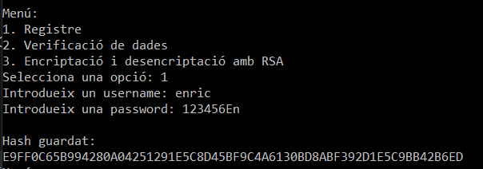
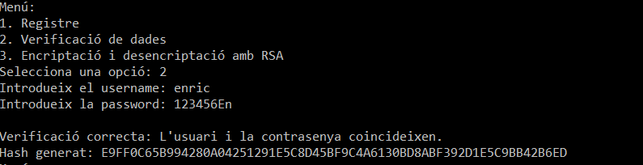
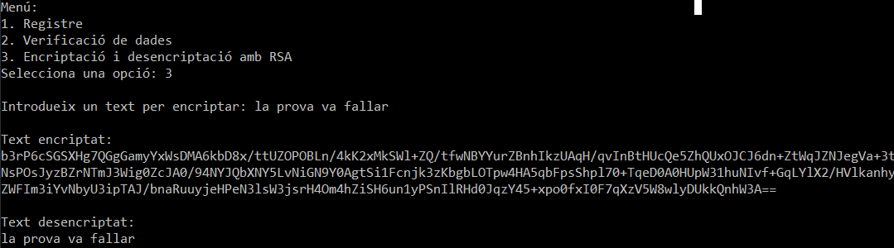

1. Pèrdua de control d'accés
Són els errors que es generen quan els sistemes de control d'accés són traspassats. Aquest sistema s'encarrega de controlar quins comandaments i accessos tenen cada usuari.
Quan es traspassen aquests sistemes, els assaltants poden fer grans mals al nostre sistema; des de poder accedir a informació d'un dels comptes que tenim dins la nostra base de dades, fins poder fer-se passar per administrador.
Els mètodes més comuns per tal d'evitar aquestes vulnerabilitats són:

Per defecte, deixar el CORS configurat de manera que si no es realitzen les comandes amb mètodes públics, denegui l'accés.
Realitzar limitacions a la taxa d'accés, així evitarem atacs massius amb eines automatitzades.
Els sistemes de validació, a part de què siguin de la mínima duració possible, també s'han d'eliminar una vegada la sessió es tanca.

2. Disseny insegur
Certament podríem dir que qualsevol sistema que falli es basa en què el seu disseny està mal realitzat, però no és exactament així. L'OWASP fa una clara distinció entre un mal disseny i una mala implementació.
Un mal disseny fa que inclús implementant tots els sistemes de seguretat possibles, l'aplicació segueixi sent insegura degut a un error en l'arrel del projecte. És una de les vulnerabilitats més comunes però més simples de solucionar.
És necessita una cultura tant dintre de l'equip de desenvolupadors com amb els qui els contracten sobre intentar sempre realitzar proves segures i constants. També s'ha d'invertir temps i recursos per realitzar aquests sistemes de seguretat mitjançant el millor coneixement disponible, tant del context de la nostra aplicació com dels sistemes de seguretat.

3. Falles criptogràfiques
Quan enviem informació a través d'internet, aquestes dades poden ser relativament fàcils d'obtenir, per això es fan servir mètodes d'encriptació. D'aquesta forma, inclús si les dades són robades, els hi costarà molt més obtenir la informació que desitjaven.
Per això és molt important tenir un molt bon sistema de criptografia i fer servir les encriptacions idònies per a cada tipus de dada.
El sistema que més recomanen al realitzar aquests sistemes són:

Classificar les dades segons el seu estat.
No guardar les dades sensibles si no és imprescindible.
Xifrar totes les dades, tant en l'enviament com dintre de la pròpia base de dades.

4. Injeccions SQL
He realitzat els següents nivells utilitzant tècniques d'injecció SQL:

1-'jane"
2-jane'--
3-'jane'; drop table users;--
4-' OR true;--
5-' OR true Limit 1;--
6-'; Select username, password from users;
7-';DROP TABLE users; SELECT salary AS username FROM staff WHERE firstname = 'Greta Maria'; --
8-' UNION SELECT name, firstname, email, salary, employed_since FROM staff;--

5. Prevenció d'atacs SQL amb Razor Pages i Entity Framework

Entity Framework permet realitzar les consultes parametritzades mitjançant LINQ. Això significa que la base de dades rebrà primer la consulta i després el valor dels paràmetres recurrents, fent així impossible la injecció.
Razor, per una altra part, té diversos sistemes per comprovar les dades que introdueix l'usuari. El més important seria el que valida automàticament els formularis; després pots aplicar comprovacions a cada dada per separat si volguessis.

6. Polítiques de seguretat per aplicació web de venda d'obres d'art

6.1 Definició del control d'accés
Els rols que crec que s'haurien de crear serien els següents:

Client: Té accés a mirar les obres i comprar-les. L'únic accés que tindria seria un select a la taula on estarien les obres i el CRUD complet respecte a les seves dades, per tant un CRUD complet quant a la taula user amb el seu id.
Artistes: Són els que realitzen les obres per tant han de tenir accés a les seves dades. Tindrien accés al CRUD complet respecte les seves obres per eliminar-les o editar-les. També a les seves dades d'usuari de la taula users.
Manager: Tindria accés complet al CRUD de totes les taules de l'aplicació, com és l'encarregat ha de poder eliminar usuaris tant client com artistes. Les obres que no compleixin les normes de la galeria també haurien de ser eliminades si per casualitat han canviat o quan es va fer la primera revisió no van veure el problema.
Admin: Rol per al gestor de la base de dades, tindria accés a tota la base de dades incloent les taules que serien còpia de seguretat o registre d'accions. Seria el rol que s'encarregaria de solucionar problemes en la base de dades si els gestors tinguessin problemes. Els errors podrien anar d'haver eliminat a un artista o client per error o haver intencionadament manipulat dades on l'administrador podria revisar si ha realitzat mal ús dels seus poders.

6.2 Definició de la política de contrasenyes

Les normes de contrasenyes són ben conegudes per qualsevol usuari d'internet: fer servir el màxim de caràcters possible (per usuaris es recomana 12 caràcters mínim) i fer servir el màxim de variació de caràcters (majúscules, minúscules, símbols especials, números, etc.). Això respecte a la creació per part de l'usuari, però l'OWASP fa també recomanacions quant a l'estructura de la comprovació i emmagatzematge de contrasenyes. Una de les més recomanades és el sistema d'autentificació en dos passos i la comprovació de si hi han contrasenyes filtrades per evitar que l'usuari la posi com a seva.

També recomanen que mai es guardin en text pla, sempre es guarden encriptades.
Quant al procés de canvi de contrasenya, es recomana que no sigui obligatori fer-ho periòdicament, poder realitzar l'operació en qualsevol moment, demanar credencials abans de realitzar-ho i sobretot notificació a l'usuari quan es realitzi.
El meu raonament és que no pots demanar-li a un usuari el mateix nivell de seguretat que per exemple a un administrador, pel simple fet que l'usuari és ignorant del perill que suposen aquestes filtracions i per tant li dona menys importància. Si l'usuari no li dona importància no farà l'esforç de tenir una contrasenya bona i si li demanes que la canviï cada cert temps acabarà ficant cada vegada una menys segura, com ja ho ha verificat l'OWASP. Per tant sí que crec que s'han de tenir diferents polítiques per cada nivell de seguretat.

6.3 Avaluació de la informació
En primer lloc, les aplicacions sempre han de treballar amb el mínim de dades possibles per evitar filtracions. Per tant, les dades amb què treballa l'aplicació haurien de ser les més inútils/menys valuoses possibles. Per exemple, si estem realitzant un joc amb microtransaccions, les dades bancàries haurien d'evitar-se, però la de quants enemics has vençut en les teves partides doncs no són de gran valor, fins i tot si el joc fos un joc competitiu.

La forma de tractar les dades més sensibles és encriptant-les. Una vegada les encriptes, inclús si es sap el procés d'encriptació pot costar més desxifrar-les que el benefici que el hacker pot aconseguir. De fet, sempre ha sigut així en la "guerra de la informació", des de la creació d'ENIAC fins avui dia amb els ordinadors quàntics.

Les dades que s'han d'encriptar 100% han de ser les que no tinguis que mostrar a l'usuari directament. Si no les has de mostrar, pots sense cap problema tenir-les encriptades sempre i només fer la comparació quan siguin necessàries amb les paraules encriptades. Per això moltes contrasenyes mai es mostren, és més fàcil mantenir la seguretat així. Després, si les has de mostrar molt sovint, com ara un nom d'usuari, doncs potser no et surt rendible ja que desencriptar costa recursos i temps.

En el cas prèviament mencionat, les contrasenyes i les dades bancàries totes estarien encriptades com a mínim.

7. Autenticació basada en tokens
És un sistema d'autentificació on la principal avantatge és aplicar un sistema de seguretat basat en credencial que pots realitzar sense estar fent consultes constants a la base de dades o fent-les de forma més segura.
Hi han molts tipus depenent de com passen la informació a la base de dades o API, quin sistema d'encriptació es passen o amb quin format es passa. Els més famosos són els següents: JWT, OAuth 2.0, Bearer Tokens, API Keys, HMAC Tokens, SAML Tokens.
El que es fa servir amb aplicacions web normalment sol ser el JWT. El seu funcionament és molt simple:

Inicies sessió: L'usuari envia les credencials (nom d'usuari i contrasenya) al servidor.
Crear token: El servidor verifica les credencials i genera un JWT amb informació de l'usuari.
Enviar token: El servidor retorna el token al client perquè el guardi.
Usar token: El client envia el token en l'encapçalament.
Verificar token: El servidor valida el token per saber si és correcta.
Expirar o renovar: Si el token expira, l'usuari ha de tornar a iniciar sessió. Pots crear tokens que es tornin a carregar amb el temps per evitar que hagin d'iniciar sessió de forma molt seguida.

7.1 Crea un projecte de consola amb un men� amb tres opcions:
Registre: l�usuari ha d�introduir username i una password. De la combinaci� dels dos camps guarda en mem�ria directament l'encriptaci�. Utilitza l�encriptaci� de hash HA256. Mostra per pantalla el resultat.

Verificaci� de dades: usuari ha de tornar a introduir les dades el programa mostra per pantalla si les dades s�n correctes.

Encriptaci� i desencriptaci� amb RSA. L�usuari entrar� un text per consola. A continuaci� mostra el text encriptat i en la seg�ent l�nia el text desencriptat. 

Referències consultades

https://owasp.org/
https://learn.microsoft.com/es-es/dotnet/api/system.security.cryptography?view=net-9.0
https://keepcoding.io/blog/que-es-un-token-en-programacion/
Chatgpt:

tipus de tokens
formateja aquest document perquè quedi més visible
Em surt un error al vincular el token d'aquest codi, revisa-me'l perquè no veig on està el problema